# Tofu: Grow Your Wealth

**Tofu** (short for **Tomi o Fuyasu**, Japanese for "grow wealth") is a financial planner app designed to help users manage and grow their wealth. The app features a simple, intuitive interface to track your financial transactions, connect to various accounts, set financial goals, and analyze your income and expenses using charts.

## Features

- **Tofu Wallet**: A built-in wallet for storing and tracking transactions.
- **Account Connections**: Allows users to link their bank accounts and other wallets for better financial tracking.
- **Financial Planning**: Users can create their own financial plans to manage savings and expenditures.
- **Charts and Analytics**:
  - Monthly income and outcome summaries.
  - Pie charts showing percentage breakdowns of income and expenses by categories such as grocery, business, salary, etc.
- **Transaction Management**:
  - Track daily, weekly, and monthly transactions.
  - Classify transactions into categories (e.g., income, outcome, business, personal, etc.).
- **Security**: Includes PIN verification for sensitive financial actions.

## Tech Stack

- **Frontend**: Flutter
- **Backend**: Firebase (Firestore, Firebase Authentication)
- **State Management**: Provider
- **Date Formatting**: `intl` package
- **UI**: Custom widgets built with Flutter's Material Design

## Getting Started

Follow these steps to get started with Tofu.

### Prerequisites

1. Install [Flutter](https://flutter.dev/docs/get-started/install) on your machine.
2. Set up [Firebase](https://firebase.google.com/docs/flutter/setup) for authentication and Firestore database.

### Clone the Repository

```bash
git clone https://github.com/dzakyadlh/tofu.git
cd tofu
```

### Install Dependencies

```bash
flutter pub get
```

### Run the App

Make sure you have an emulator running or a device connected, then run:

```bash
flutter run
```

## Firebase Configuration

1. Set up Firebase for your Flutter project.
2. In the Firebase console, enable **Authentication** (email/password sign-in).
3. Set up **Firestore** and configure collections for transactions, accounts, and user data.
4. Download the `google-services.json` file and add it to your project’s `android/app` directory.

### Example Firestore Structure

```plaintext
users (collection)
  |-- userId (document)
       |-- wallet (map)
           |-- balance: 1000
       |-- transactions (sub-collection)
           |-- transactionId (document)
                |-- title: "Salary"
                |-- amount: 1500
                |-- date: timestamp
                |-- category: "salary"
       |-- connected_accounts (sub-collection)
           |-- accountId (document)
                |-- name: "Visa"
                |-- accountNumber: "1234"
                |-- balance: 500
```

## Folder Structure

```plaintext
/lib
├── main.dart             # Main entry point
├── providers             # State management providers (e.g., ConnectedAccountsProvider, UserProvider)
├── screens               # UI screens (e.g., HomeScreen, TransactionDetailScreen)
├── theme.dart            # App-wide theme and styling
├── utils                 # Utility functions and helpers
└── widgets               # Reusable UI components (e.g., CustomInputField, TransactionCard)
```

## App Screens

### 1. **Home Screen**

- Displays the user's wallet balance.
- Option to view financial transactions and plans.
- Allows users to transfer funds or top-up their wallet.

### 2. **Portfolio Screen**

- Displays the user's financial growth chart.
- Pie charts showing the breakdown of income and expenses.

### 3. **Profile Screen**

- Displays the user's profile.
- Option to update the profile and manage connected accounts.
- Includes settings for app customization.

### 4. **Transactions Screen**

- Displays a list of recent transactions.
- Users can filter and categorize their transactions.
- Option to see detailed transaction breakdowns.

### 5. **Financial Plans**

- Users can create and view their financial plans.
- Includes saving goals and budgeting features.

### 6. **Transfer and Top-up**

- Users can transfer funds to other users within Tofu Wallet.
- Wallet balance can be topped up using connected accounts.
- Includes pin verification for secure transactions.

| 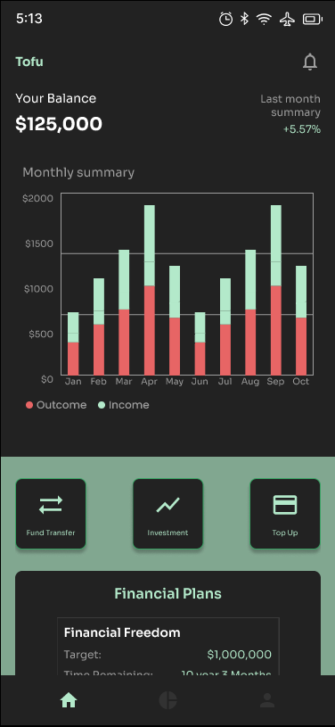 | 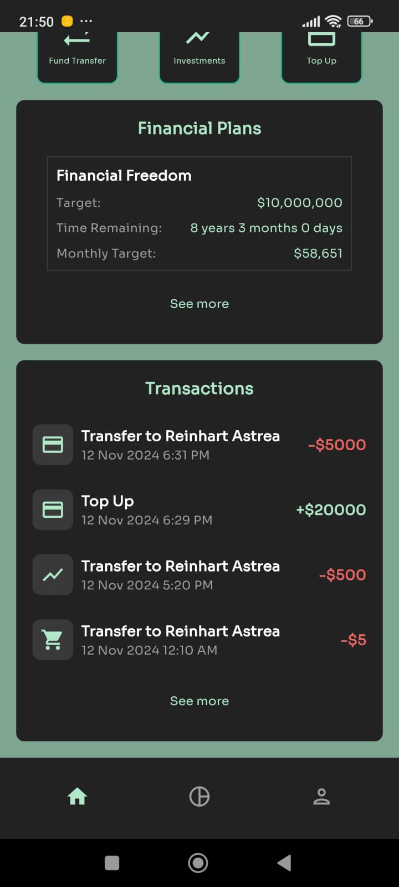 | 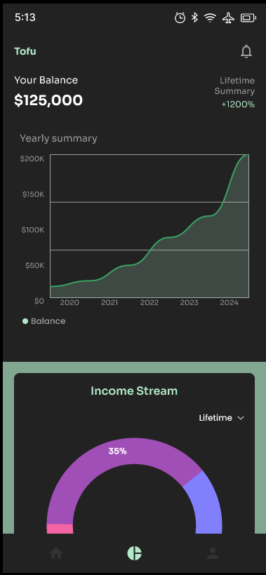 |
|--------------------------------------------------|---------------------------------------------------|------------------------------------------------------------|
| 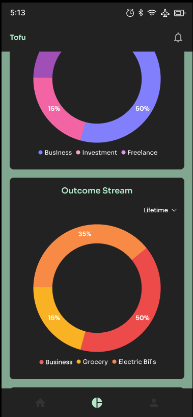 | 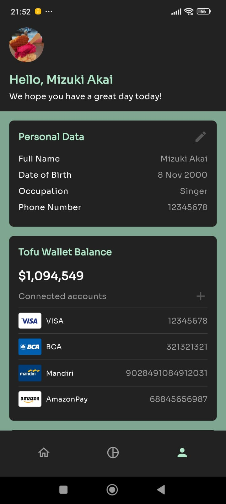 | 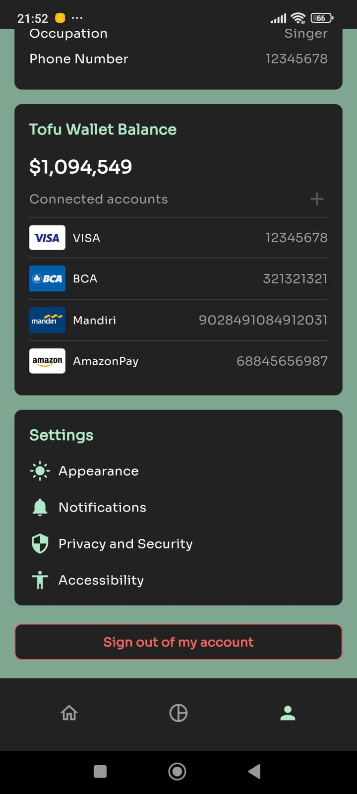 |
| 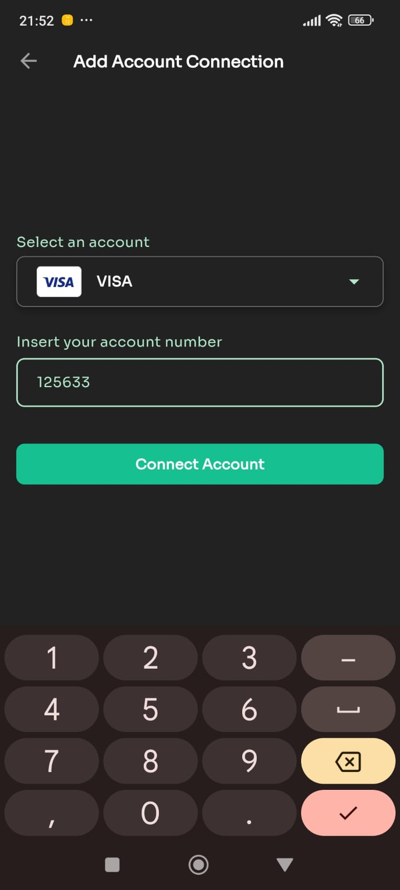 | 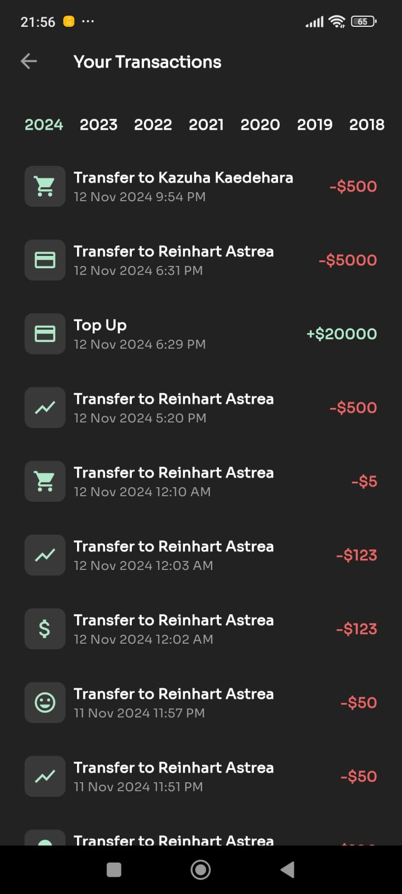 | 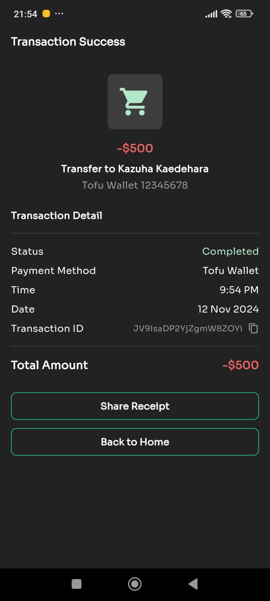 |
| 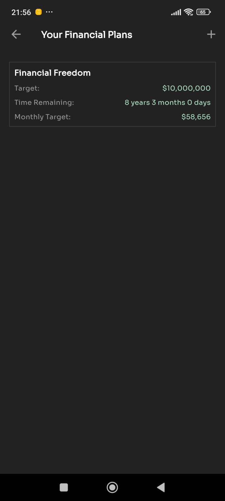 | 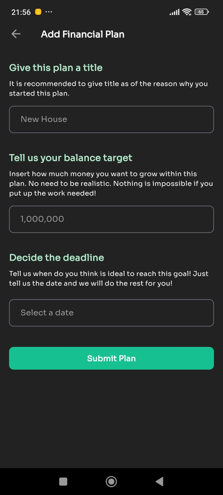 | 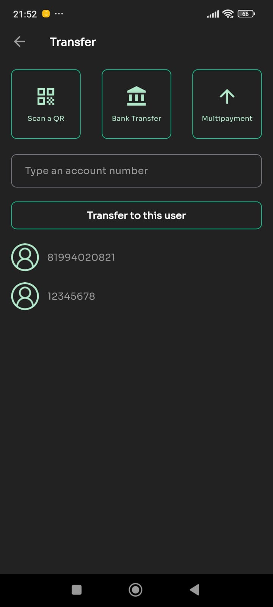 |
| 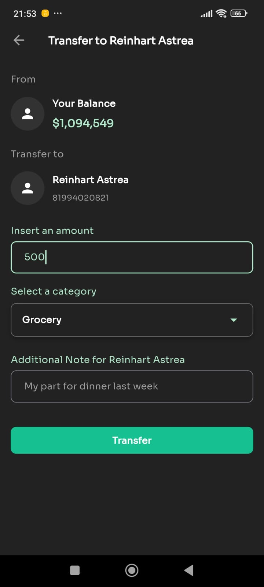 | 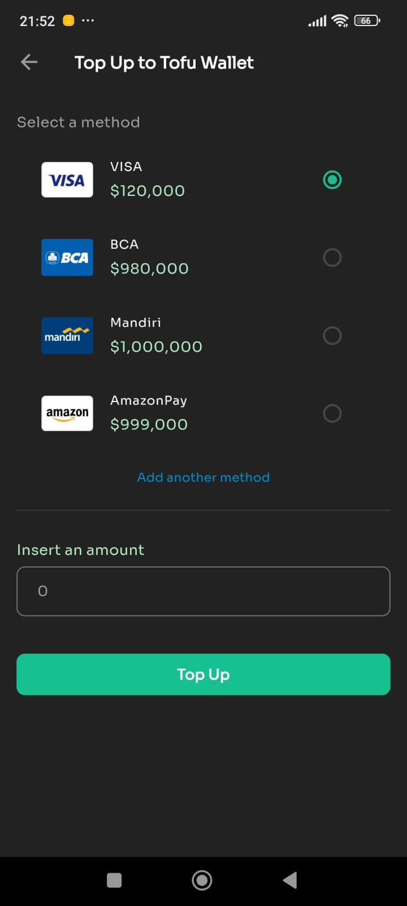 | 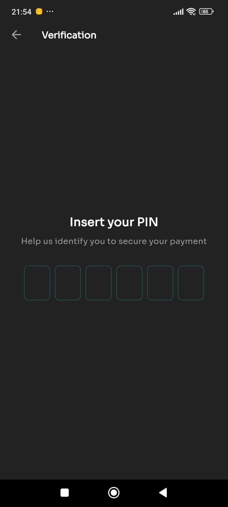 |
| 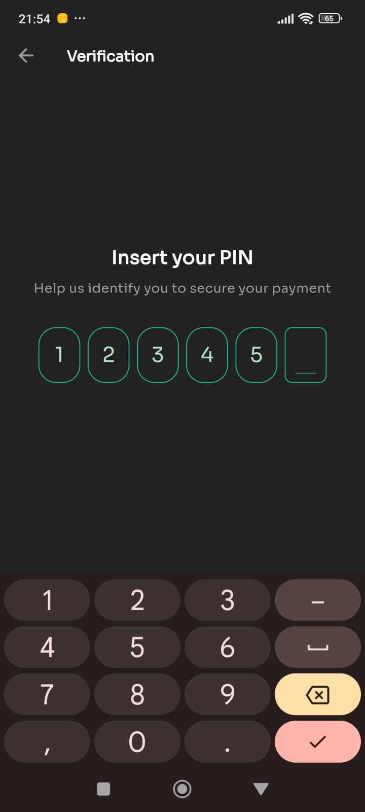 | 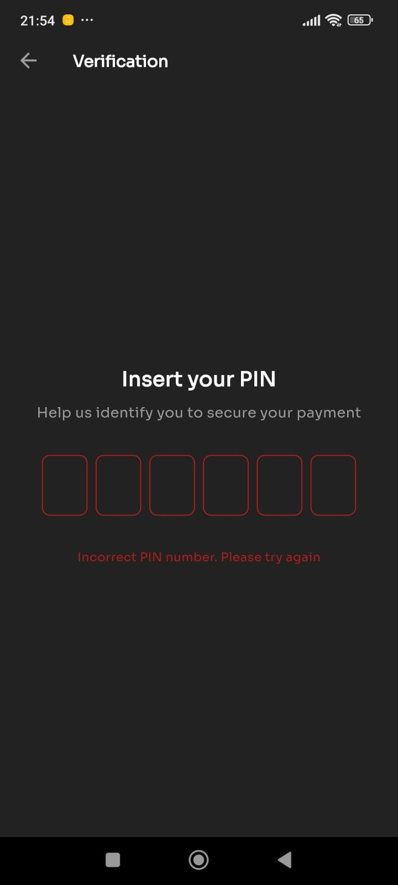 | |


## Contributing

We welcome contributions to Tofu! Here’s how you can help:

1. Fork the repo.
2. Create a new branch (`git checkout -b feature/new-feature`).
3. Make your changes.
4. Commit your changes (`git commit -m 'Add new feature'`).
5. Push to the branch (`git push origin feature/new-feature`).
6. Open a pull request.

### Issues

If you encounter any issues, feel free to open an issue on the GitHub repository. We will look into it and get back to you as soon as possible.

## License

This project is licensed under the MIT License - see the [LICENSE](LICENSE) file for details.

## Additional Notes

This project is intended for portfolio purposes only. Please do not input real bank or wallet account details, as this may cause unintended issues.
